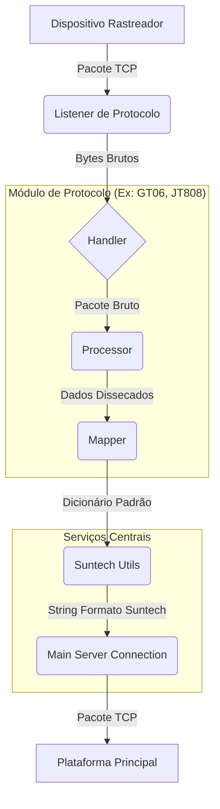
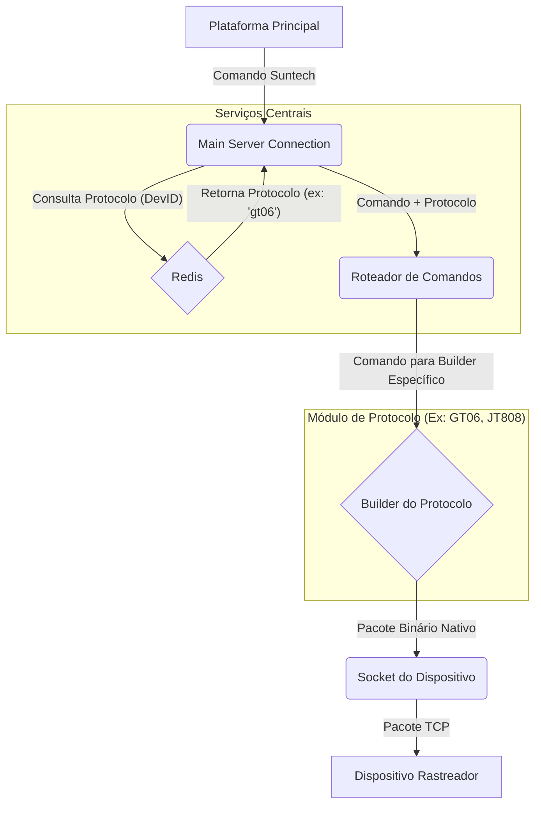

# Servidor Gateway Poliglota para Rastreamento Veicular: O Tradutor Universal

Este não é apenas um servidor de rastreamento. É um **gateway de tradução universal**, projetado para resolver um dos maiores desafios no setor de telemétria: a **fragmentação de protocolos**. Com uma arquitetura modular e de alto desempenho, este projeto atua como a ponte definitiva entre centenas de modelos de rastreadores e a sua plataforma central.

## O Poder do Gateway Poliglota

A força deste projeto reside em sua arquitetura inteligente e desacoplada, que oferece funcionalidades muito além de uma simples tradução de dados.

*   **Arquitetura "Plug-and-Play"**: Adicionar suporte a um novo protocolo é tão simples quanto criar um novo diretório. A estrutura modular isola completamente a lógica de cada protocolo, permitindo que o sistema cresça sem complexidade adicional. O orquestrador em [`main.py`](main.py) carrega dinamicamente cada protocolo configurado em [`app/config/settings.py`](app/config/settings.py), iniciando listeners dedicados em threads separadas.

*   **Tradução para um Dicionário Universal**: A genialidade do sistema está na sua camada de `mapper` (ex: [`app/src/protocols/gt06/mapper.py`](app/src/protocols/gt06/mapper.py)). Cada `mapper` converte o dialeto específico de seu protocolo para um **dicionário Python padronizado**. Isso significa que a lógica de saída (o módulo Suntech) não precisa saber nada sobre os protocolos de entrada, garantindo um desacoplamento total.

*   **Geração de Eventos com Estado (Inteligência Agregada)**: O gateway não é um tradutor "burro". Utilizando o Redis ([`app/services/redis_service.py`](app/services/redis_service.py)), ele armazena o estado de cada dispositivo (como ignição ligada/desligada). Ao receber um novo pacote, ele compara o estado atual com o anterior e pode **gerar novos eventos de alerta** (ex: "Alerta de Ignição Ligada") que não existiam no protocolo original, agregando valor e inteligência aos dados brutos.

*   **Roteamento Reverso de Comandos**: O fluxo de comandos (downlink) é igualmente inteligente. Quando a plataforma principal envia um comando no formato Suntech, o [`app/src/connection/main_server_connection.py`](app/src/connection/main_server_connection.py) usa o Redis para identificar o protocolo de origem do dispositivo de destino. Em seguida, ele invoca o `builder` específico daquele protocolo (ex: [`app/src/protocols/gt06/builder.py`](app/src/protocols/gt06/builder.py)) para construir e enviar o comando no "idioma" nativo do rastreador.

## Arquitetura do Sistema

A arquitetura foi desenhada para máxima clareza, escalabilidade e manutenibilidade.

### Fluxo de Dados (Uplink: Dispositivo -> Plataforma)

Este diagrama mostra como os dados de um rastreador são recebidos, traduzidos e encaminhados para a plataforma final.



### Fluxo de Comandos (Downlink: Plataforma -> Dispositivo)

Este diagrama ilustra como os comandos são enviados da plataforma de volta para o dispositivo correto, na linguagem correta.



## Protocolos Suportados

*   **GT06**: Um dos protocolos mais comuns em dispositivos de rastreamento genéricos.
*   **JT/T 808**: Um protocolo padrão robusto, amplamente utilizado em veículos comerciais.

## Como Começar

### Pré-requisitos

*   Python 3.9+
*   Redis

### Instalação e Configuração

1.  **Clone o repositório:**
    ```bash
    git clone <url-do-seu-repositorio>
    cd <nome-do-repositorio>
    ```

2.  **Crie e ative um ambiente virtual:**
    ```bash
    python -m venv venv
    source venv/bin/activate  # No Windows: `venv\Scripts\activate`
    ```

3.  **Instale as dependências:**
    ```bash
    pip install -r requirements.txt
    ```

4.  **Configure seu ambiente:**
    Crie um arquivo `.env` na raiz do projeto e preencha as variáveis de ambiente. Você pode usar o arquivo `.env.example` como modelo.
    ```
    LOG_LEVEL=INFO
    MAIN_SERVER_HOST=127.0.0.1
    MAIN_SERVER_PORT=12345
    REDIS_DB_MAIN=2
    REDIS_PASSWORD=...
    REDIS_HOST=127.0.0.1
    REDIS_PORT=6379
    ```

### Executando o Servidor

Para iniciar o servidor, execute o arquivo [`main.py`](main.py):

```bash
python main.py
```
O servidor iniciará os listeners para todos os protocolos definidos em [`app/config/settings.py`](app/config/settings.py).

## Como Adicionar um Novo Protocolo

A arquitetura foi pensada para que a adição de novos protocolos seja um processo simples e direto:

1.  **Crie o Diretório do Protocolo:**
    Dentro de `app/src/protocols/`, crie um novo diretório com o nome do seu protocolo (ex: `novo_protocolo`).

2.  **Implemente os Módulos Essenciais:**
    Crie os seguintes arquivos dentro do novo diretório, seguindo a estrutura dos módulos `gt06` ou `jt808`:
    *   `handler.py`: Gerencia o ciclo de vida da conexão TCP.
    *   `processor.py`: Valida a integridade e disseca a estrutura dos pacotes.
    *   `mapper.py`: **O coração da tradução**. Converte os dados do protocolo para o dicionário Python padronizado.
    *   `builder.py`: Constrói pacotes no idioma nativo do protocolo para enviar respostas e comandos.

3.  **Registre o Protocolo:**
    Abra o arquivo [`app/config/settings.py`](app/config/settings.py) e adicione a configuração do seu novo protocolo no dicionário `PROTOCOLS`:
    ```python
    PROTOCOLS = {
        # ... protocolos existentes
        "novo_protocolo": {
            "port": 65434,  # Escolha uma porta livre
            "handler_path": "app.src.protocols.novo_protocolo.handler.handle_connection"
        }
    }
    ```

4.  **Habilite a Tradução Reversa de Comandos:**
    Em [`app/src/connection/main_server_connection.py`](app/src/connection/main_server_connection.py), importe a função `process_suntech_command` do seu novo `builder` e adicione-a ao dicionário `COMMAND_PROCESSORS`.

## Tecnologias Utilizadas

*   **Python**: Linguagem principal do projeto.
*   **Redis**: Utilizado como uma memória de curto prazo para gerenciamento de estado das sessões e dos dispositivos.
*   **Pydantic**: Para gerenciamento de configurações e validação de dados.