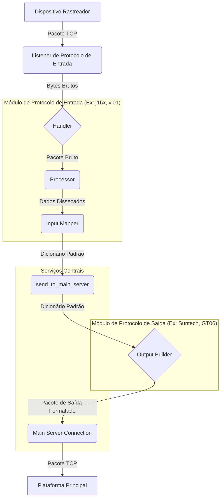
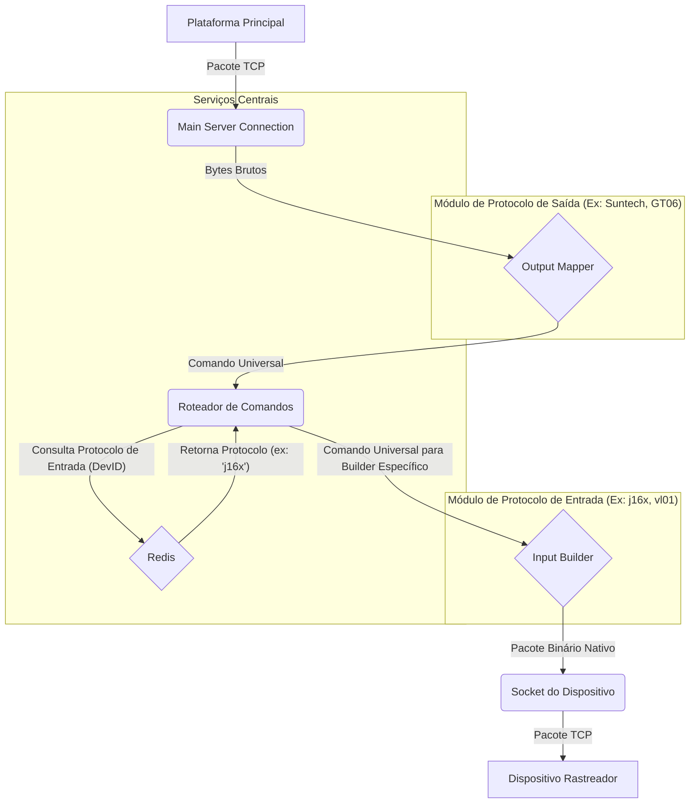

# Servidor Gateway Poliglota para Rastreamento Veicular

Este projeto é um **gateway de tradução universal** para o setor de telemétria, projetado para resolver o desafio da **fragmentação de protocolos**. Com uma arquitetura modular e de alto desempenho, ele atua como uma ponte entre diversos modelos de rastreadores e uma plataforma central.

## Tabela de Conteúdos
- [Visão Geral](#visão-geral)
- [Principais Funcionalidades](#principais-funcionalidades)
- [Arquitetura do Sistema](#arquitetura-do-sistema)
  - [Fluxo de Dados (Uplink)](#fluxo-de-dados-uplink-dispositivo---plataforma)
  - [Fluxo de Comandos (Downlink)](#fluxo-de-comandos-downlink-plataforma---dispositivo)
- [Dados Persistidos no Redis](#dados-persistidos-no-redis)
- [Protocolos Suportados](#protocolos-suportados)
- [Endpoints da API](#endpoints-da-api)
- [Como Começar](#como-começar)
- [Como Adicionar um Novo Protocolo](#como-adicionar-um-novo-protocolo)
- [Tecnologias Utilizadas](#tecnologias-utilizadas)

## Visão Geral

A força deste projeto reside em sua arquitetura inteligente e desacoplada, que oferece funcionalidades muito além de uma simples tradução de dados. Ele foi desenhado para ser uma solução "plug-and-play", onde adicionar suporte a novos protocolos de entrada ou saída exige o mínimo de esforço, sem impactar a estabilidade do sistema existente. O objetivo é fornecer uma base robusta e flexível para qualquer plataforma de rastreamento.

## Principais Funcionalidades

*   **Arquitetura Modular "Plug-and-Play"**: Adicionar suporte a um novo protocolo é tão simples quanto criar um novo módulo. A estrutura isola a lógica de cada protocolo, permitindo que o sistema evolua sem aumento de complexidade. O orquestrador em [`main.py`](main.py) carrega dinamicamente cada protocolo, iniciando listeners dedicados em threads separadas.

*   **Tradução Bidirecional (N x N)**: O sistema traduz múltiplos protocolos de entrada para múltiplos protocolos de saída. Cada `mapper` de entrada converte o dialeto do dispositivo para um **dicionário Python padronizado**. A camada de `output` (ex: [`app/src/output/suntech/builder.py`](app/src/output/suntech/builder.py)) utiliza esse dicionário para construir pacotes nos formatos de saída desejados, garantindo um desacoplamento total.

*   **Inteligência Agregada com Gestão de Estado**: O gateway utiliza o Redis ([`app/services/redis_service.py`](app/services/redis_service.py)) para armazenar o estado de cada dispositivo. Ao receber um novo pacote, ele compara o estado atual com o anterior e pode **gerar novos eventos de alerta** (ex: "Alerta de Ignição Ligada") que não existiam no protocolo original, agregando valor e inteligência aos dados.

*   **Roteamento Reverso de Comandos**: O fluxo de comandos (downlink) é igualmente robusto. Comandos recebidos pela plataforma são traduzidos por um `mapper` de saída (ex: [`app/src/output/suntech/mapper.py`](app/src/output/suntech/mapper.py)) para um formato universal. O sistema então identifica o protocolo de origem do dispositivo e invoca o `builder` correspondente (ex: [`app/src/input/j16x/builder.py`](app/src/input/j16x/builder.py)) para enviar o comando no formato nativo do rastreador.

## Arquitetura do Sistema

A arquitetura foi desenhada para máxima clareza, escalabilidade e manutenibilidade. A seguir, os fluxos de dados e comandos são detalhados para ilustrar o funcionamento interno do gateway.

### Fluxo de Dados (Uplink: Dispositivo -> Plataforma)

Este diagrama mostra como os dados de um rastreador são recebidos, traduzidos e encaminhados para a plataforma final.



### Fluxo de Comandos (Downlink: Plataforma -> Dispositivo)

Este diagrama ilustra como os comandos são enviados da plataforma de volta para o dispositivo correto, na linguagem correta.



## Dados Persistidos no Redis

O Redis é utilizado como um armazenamento de estado de curto prazo e cache para otimizar as operações do gateway. As chaves são categorizadas principalmente por `device_id` (IMEI) para dados do rastreador e chaves `history:<device_id>` para o histórico de pacotes.

### Estrutura de Dados do Dispositivo (`<device_id>`)

Para cada rastreador conectado ou que já se conectou, um hash é mantido no Redis sob a chave sendo o `device_id` (geralmente o IMEI em formato hexadecimal ou string, dependendo do protocolo).

| Campo                  | Tipo      | Descrição                                                                         | Exemplo             |
| :--------------------- | :-------- | :-------------------------------------------------------------------------------- | :------------------ |
| `protocol`             | `string`  | O protocolo que o dispositivo utiliza (ex: `j16x`, `jt808`, `vl01`, `nt40`).        | `"j16x"`            |
| `output_protocol`      | `string`  | O protocolo de saída que o dispositivo utiliza (ex: `suntech`, `gt06`).        | `"suntech"`            |
| `imei`                 | `string`  | O IMEI do dispositivo.                                                            | `"358204012345678"` |
| `last_serial`          | `integer` | O último número de série do pacote recebido do dispositivo.                       | `"12345"`           |
| `last_active_timestamp`| `string`  | Timestamp UTC da última vez que o dispositivo enviou qualquer tipo de pacote (ISO 8601). | `"2023-10-27T10:35:00.123456+00:00"` |
| `last_event_type`      | `string`  | O tipo do último evento recebido (`location`, `heartbeat`, `alarm`, `information`). | `"location"`        |
| `total_packets_received`| `integer` | Contador total de pacotes recebidos do dispositivo desde o início.               | `"1501"`            |
| `last_packet_data`   | `JSON string` | Dados da última localização decodificada do protocolo, usados internamente para alertas (menos campos). | `{"latitude": -23.55, ...}` |
| `last_full_location`   | `JSON string` | Dados completos da última localização reportada, incluindo todos os detalhes.    | `{"timestamp": "2023-10-27T...", "latitude": -23.55, "speed_kmh": 60, ...}` |
| `odometer`             | `float`   | Odômetro calculado pelo servidor (em metros), baseado na distância Haversine. | `"12345678.90"`     |
| `acc_status`           | `integer` | Status da ignição (0: OFF, 1: ON).                                                | `"1"`               |
| `power_status`         | `integer` | Status da alimentação principal (0: Conectada, 1: Desconectada).                  | `"0"`               |
| `last_voltage`         | `float`   | Última voltagem da bateria do dispositivo reportada.                              | `"12.8"`            |
| `last_output_status`   | `integer` | Último estado da saída de controle (ex: bloqueio) (0: Desligado, 1: Ligado).     | `"1"`               |
| `last_command_sent`    | `JSON string` | Detalhes do último comando enviado do servidor para o dispositivo.             | `{"command": "RELAY 0", "timestamp": "...", "packet_hex": "..."}` |
| `last_command_response`| `JSON string` | Detalhes da última resposta de comando recebida do dispositivo. (Atualmente não implementado para todos os protocolos) | `{"response": "OK", "timestamp": "..."}` |

### Gerenciamento Avançado de Dados (Exemplo: Protocolo VL01)

O sistema permite a implementação de lógicas avançadas de gerenciamento de dados diretamente no gateway. O protocolo VL01, por exemplo, utiliza o [`mapper.py`](app/src/input/vl01/mapper.py) para enriquecer os dados brutos com informações calculadas pelo servidor.

#### Estratégias de Gerenciamento de Pacotes:

*   **Fila Persistente de Pacotes (Redis)**: Pacotes de localização, alarme e informação recebidos do protocolo VL01 são adicionados a uma fila persistente no Redis (`vl01_persistent_packet_queue`). Isso garante que os dados não sejam perdidos em caso de falha do servidor e permite o processamento ordenado.
*   **Processamento em Lotes**: A fila processa os pacotes em lotes de 30, garantindo que sejam tratados na ordem cronológica de seus timestamps (extraídos do próprio pacote quando disponíveis).

#### Informações Gerenciadas Exclusivamente pelo Servidor:

Alguns dados cruciais são calculados ou mantidos inteiramente no servidor, agregando inteligência aos dados brutos:

*   **Odômetro (`gps_odometer`)**: O valor do odômetro é calculado pelo servidor utilizando a fórmula de Haversine com base nas coordenadas de localização recebidas. Este valor é persistido no Redis e acumulado ao longo do tempo.
*   **Voltagem (`last_voltage`)**: A voltagem da bateria do dispositivo é extraída de pacotes de informação específicos e armazenada no Redis, permitindo um acompanhamento preciso do estado de energia do rastreador.

### Histórico de Pacotes (`history:<device_id>`)

Para cada dispositivo, uma lista é mantida no Redis contendo os pacotes brutos e seus respectivos pacotes Suntech traduzidos. Esta lista é limitada a `HISTORY_LIMIT` (definido em [`app/services/history_service.py`](app/services/history_service.py)) entradas.

| Campo            | Tipo      | Descrição                                         | Exemplo                       |
| :--------------- | :-------- | :------------------------------------------------ | :---------------------------- |
| `raw_packet`     | `string`  | O pacote original recebido do rastreador (hex).   | `"78780d01..."`               |
| `translated_packet` | `string`  | O pacote traduzido para o formato de saída.        | `">STT,IMEI,..."` ou `"7878..."` |

## Protocolos Suportados

### Entrada

*   **GT06**: Um dos protocolos mais comuns em dispositivos de rastreamento genéricos.
*   **JT/T 808**: Um protocolo padrão robusto, amplamente utilizado em veículos comerciais.
*   **VL01**: Protocolo específico com gerenciamento avançado de dados no servidor.

### Saída

*   **Suntech**
*   **GT06**


## Endpoints da API

O servidor gateway expõe uma API RESTful para consulta de dados em tempo real e gerenciamento de sessões, facilitando a integração com outras plataformas e painéis de monitoramento.

### `GET /trackers`
Retorna um dicionário com todos os dados dos rastreadores salvos no Redis, incluindo o status de conexão (`is_connected`).
Exemplo de Resposta:
```json
{
  "IMEI_DO_RASTREADOR_1": {
    "protocol": "j16x",
    "last_active_timestamp": "2023-10-27T10:30:00.000000+00:00",
    "is_connected": true,
    "last_packet_data": "{\"latitude\": -23.55052, ...}",
    "odometer": "12345.67",
    "acc_status": "1",
    "power_status": "0",
    "last_voltage": "12.5",
    "imei": "IMEI_DO_RASTREADOR_1",
    "last_full_location": "{\"latitude\": -23.55052, ...}",
    "last_event_type": "location",
    "total_packets_received": "1500"
  },
  "IMEI_DO_RASTREADOR_2": {
    "protocol": "nt40",
    "is_connected": false,
    "last_active_timestamp": "2023-10-27T09:45:00.000000+00:00",
    "...": "..."
  }
}
```

### `GET /trackers/summary`
Fornece estatísticas de alto nível sobre os rastreadores no sistema.
Exemplo de Resposta:
```json
{
  "total_registered_trackers": 50,
  "total_active_translator_sessions": 25,
  "total_active_main_server_sessions": 20,
  "protocol_distribution": {
    "j16x": 30,
    "jt808": 15,
    "vl01": 5
  },
  "total_packets_in_history": 120000,
  "most_recent_active_trackers": [
    {"device_id": "IMEI_RECENTE_1", "last_active_timestamp": "2023-10-27T10:35:00.000000+00:00"},
    {"device_id": "IMEI_RECENTE_2", "last_active_timestamp": "2023-10-27T10:34:00.000000+00:00"}
  ]
}
```

### `GET /trackers/<dev_id>/details`
Retorna detalhes abrangentes para um rastreador específico, incluindo dados do Redis e status de conexão.
Exemplo de Resposta:
```json
{
  "device_id": "IMEI_DO_RASTREADOR",
  "imei": "IMEI_DO_RASTREADOR",
  "protocol": "j16x",
  "is_connected_translator": true,
  "is_connected_main_server": true,
  "last_active_timestamp": "2023-10-27T10:35:00.000000+00:00",
  "last_event_type": "location",
  "total_packets_received": 1501,
  "last_packet_data": { /* ... */ },
  "last_full_location": {
    "timestamp": "2023-10-27T10:35:00+00:00",
    "satellites": 8,
    "latitude": -23.55052,
    "longitude": -46.63330,
    "speed_kmh": 60,
    "direction": 90,
    "gps_fixed": 1,
    "acc_status": 1,
    "is_realtime": true,
    "gps_odometer": 12345.67,
    "voltage": 12.8
  },
  "odometer": 12345.67,
  "acc_status": 1,
  "power_status": 0,
  "last_voltage": 12.8,
  "last_command_sent": {
    "command": "RELAY 0",
    "timestamp": "2023-10-27T10:30:00.000000+00:00",
    "packet_hex": "..."
  },
  "last_command_response": {},
  "device_status": "Moving (Ignition On)"
}
```

### `POST /trackers/<dev_id>/command`
Envia um comando nativo para um rastreador específico através de sua conexão ativa.
**Corpo da Requisição:**
```json
{
  "command": "RELAY 0"
}
```
Exemplo de Resposta:
```json
{
  "status": "Command sent successfully",
  "device_id": "IMEI_DO_RASTREADOR",
  "command": "RELAY 0",
  "packet_hex": "..."
}
```

### `GET /trackers/<dev_id>/history`
Recupera o histórico de pacotes (brutos e traduzidos) para um rastreador específico.
Exemplo de Resposta:
```json
[
  {
    "raw_packet": "7878...",
    "translated_packet": ">STT..."
  },
  {
    "raw_packet": "7878...",
    "translated_packet": ">ALT..."
  }
]
```

### `GET /sessions/trackers`
Retorna uma lista dos IDs de dispositivos com sessões de socket ativas com o gateway tradutor.
Exemplo de Resposta:
```json
["IMEI_RASTREADOR_1", "IMEI_RASTREADOR_2"]
```

### `GET /sessions/main-server`
Retorna uma lista dos IDs de dispositivos com sessões ativas com o servidor principal.
Exemplo de Resposta:
```json
["IMEI_RASTREADOR_1", "IMEI_RASTREADOR_3"]
```

## Como Começar

Siga os passos abaixo para configurar e executar o servidor em seu ambiente de desenvolvimento.

### Pré-requisitos

*   Python 3.9+
*   Redis

### Instalação e Configuração

1.  **Clone o repositório:**
    ```bash
    git clone <url-do-seu-repositorio>
    cd <nome-do-repositorio>
    ```

2.  **Crie e ative um ambiente virtual:**
    ```bash
    python -m venv venv
    source venv/bin/activate  # No Windows: `venv\Scripts\activate`
    ```

3.  **Instale as dependências:**
    ```bash
    pip install -r requirements.txt
    ```

4.  **Configure seu ambiente:**
    Crie um arquivo `.env` na raiz do projeto e preencha as variáveis de ambiente. Você pode usar o arquivo `.env.example` como modelo.
    ```
    LOG_LEVEL=INFO
    SUNTECH_MAIN_SERVER_HOST=127.0.0.1
    SUNTECH_MAIN_SERVER_PORT=12345
    GT06_MAIN_SERVER_HOST=127.0.0.1
    GT06_MAIN_SERVER_PORT=54321
    REDIS_DB_MAIN=2
    REDIS_PASSWORD=...
    REDIS_HOST=127.0.0.1
    REDIS_PORT=6379
    ```

### Executando o Servidor

Para iniciar o servidor, execute o arquivo [`main.py`](main.py):

```bash
python main.py
```
O servidor iniciará os listeners para todos os protocolos definidos em [`app/config/settings.py`](app/config/settings.py).

## Como Adicionar um Novo Protocolo

### Protocolo de Entrada

1.  **Crie o Diretório do Protocolo:**
    Dentro de `app/src/input/`, crie um novo diretório com o nome do seu protocolo (ex: `novo_protocolo`).

2.  **Implemente os Módulos Essenciais:**
    Crie os seguintes arquivos dentro do novo diretório, seguindo a estrutura dos módulos `j16x` ou `jt808`:
    *   `handler.py`: Gerencia o ciclo de vida da conexão TCP.
    *   `processor.py`: Valida a integridade e disseca a estrutura dos pacotes.
    *   `mapper.py`: **O coração da tradução**. Converte os dados do protocolo para o dicionário Python padronizado.
    *   `builder.py`: Constrói pacotes no idioma nativo do protocolo para enviar respostas e comandos.

3.  **Registre o Protocolo:**
    Abra o arquivo [`app/config/settings.py`](app/config/settings.py) e adicione a configuração do seu novo protocolo no dicionário `INPUT_PROTOCOL_HANDLERS`:
    ```python
    INPUT_PROTOCOL_HANDLERS = {
        # ... protocolos existentes
        "novo_protocolo": {
            "port": 65434,  # Escolha uma porta livre
            "handler_path": "app.src.input.novo_protocolo.handler.handle_connection"
        }
    }
    ```

4.  **Habilite a Tradução Reversa de Comandos:**
    Em [`app/config/settings.py`](app/config/settings.py), importe a função `process_command` do seu novo `builder` e adicione-a ao dicionário `OUTPUT_PROTOCOL_COMMAND_PROCESSORS`.

### Protocolo de Saída

1.  **Crie o Diretório do Protocolo:**
    Dentro de `app/src/output/`, crie um novo diretório com o nome do seu protocolo (ex: `novo_protocolo`).

2.  **Implemente os Módulos Essenciais:**
    Crie os arquivos `builder.py` e `mapper.py` dentro do novo diretório, seguindo a estrutura dos módulos `suntech` ou `gt06`.
    *   `builder.py`: Deve conter as funções para construir os diferentes tipos de pacotes de saída (login, localização, heartbeat, etc.).
    *   `mapper.py`: Deve conter a função `map_to_universal_command` para traduzir comandos recebidos da plataforma principal para o formato universal.

3.  **Registre o Protocolo:**
    Abra o arquivo [`app/config/output_protocol_settings.py`](app/config/output_protocol_settings.py) e adicione a configuração do seu novo protocolo nos dicionários `OUTPUT_PROTOCOL_PACKET_BUILDERS`, `OUTPUT_PROTOCOL_COMMAND_MAPPERS`, e `OUTPUT_PROTOCOL_HOST_ADRESSES`.

## Tecnologias Utilizadas

*   **Python**: Linguagem principal do projeto.
*   **Redis**: Utilizado como uma memória de curto prazo para gerenciamento de estado das sessões e dos dispositivos.
*   **Pydantic**: Para gerenciamento de configurações e validação de dados.
