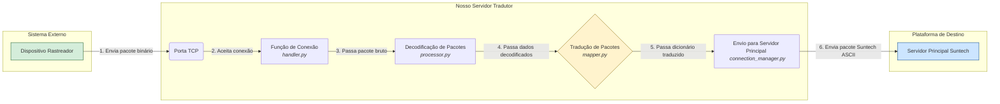

# 🚀 Servidor Tradutor de Protocolos de Rastreamento


Um gateway de telemetria de alta performance, assíncrono e poliglota, construído em Python. Este projeto atua como um servidor intermediário (proxy/tradutor) capaz de receber conexões de diversos modelos de rastreadores veiculares, cada um com seu próprio protocolo, e traduzir seus dados para um formato unificado antes de encaminhá-los para uma plataforma de destino.

O principal objetivo é resolver o problema de integração de hardware heterogêneo, permitindo que uma única plataforma de software receba dados de inúmeros dispositivos diferentes de forma transparente.

---

## ✨ Funcionalidades Principais

* **Arquitetura Poliglota "Plug-and-Play"**: Adicionar suporte a um novo protocolo de rastreador é tão simples quanto criar um novo módulo, sem a necessidade de alterar o núcleo do sistema.
* **Tradução Bidirecional**: Não apenas recebe e traduz dados dos rastreadores, mas também é capaz de receber comandos da plataforma final, traduzi-los para o protocolo específico do dispositivo e enviá-los de volta.
* **Gerenciador de Sessão Persistente**: Mantém conexões TCP persistentes e individuais tanto com os rastreadores quanto com a plataforma de destino, imitando o comportamento real dos dispositivos e garantindo a estabilidade da comunicação.
* **Geração de Eventos com Estado (Stateful)**: Utiliza Redis para armazenar o estado anterior dos dispositivos, permitindo a geração de eventos cruciais que não existem no protocolo original, como "Ignição Ligada/Desligada" e "Alimentação Principal Cortada/Restaurada".
* **Alta Performance e Escalabilidade**: Construído com uma arquitetura multithreading, onde cada conexão (seja de um rastreador ou para a plataforma) é gerenciada em sua própria thread, garantindo que o servidor seja responsivo e capaz de lidar com centenas de conexões simultâneas.
* **Configuração Centralizada**: Gerenciamento de todas as configurações sensíveis e de ambiente através de um arquivo `.env` e um módulo de settings robusto com Pydantic.

---

## 🏗️ Arquitetura do Sistema

O sistema foi projetado para ser modular e desacoplado. A comunicação flui de forma organizada através de componentes com responsabilidades únicas.


Para comunicação **Rastreador -> Tradutor -> Server Principal:**




Para comunicação **Server Principal -> Tradutor -> Rastreador:**

```mermaid
graph LR
    subgraph "Plataforma de Destino"
        A[Servidor Principal Suntech]
    end

    subgraph "Nosso Servidor Tradutor"
        B[Escuta de Comandos <br> <i>connection_manager.py</i>]
        C{Roteador de Comandos}
        D[(Redis <br><i>'Qual o protocolo?'</i>)]
        E[Tradução Reversa <br> <i>builder.py do protocolo</i>]
        F[Envio para Dispositivo <br> <i>session_manager.py</i>]
    end

    subgraph "Sistema Externo"
        G[Dispositivo Rastreador]
    end

    A -- "1. Envia comando ASCII" --> B
    B -- "2. Recebe e passa ao roteador" --> C
    C -- "3. Consulta protocolo do device" --> D
    D -- "4. Retorna protocolo" --> C
    C -- "5. Chama tradutor correto" --> E
    E -- "6. Constrói pacote de comando binário" --> F
    F -- "7. Envia pela conexão ativa" --> G

    style A fill:#cce5ff,stroke:#004085
    style G fill:#d4edda,stroke:#155724
    style C fill:#fff3cd,stroke:#856404
    style D fill:#f8d7da,stroke:#721c24